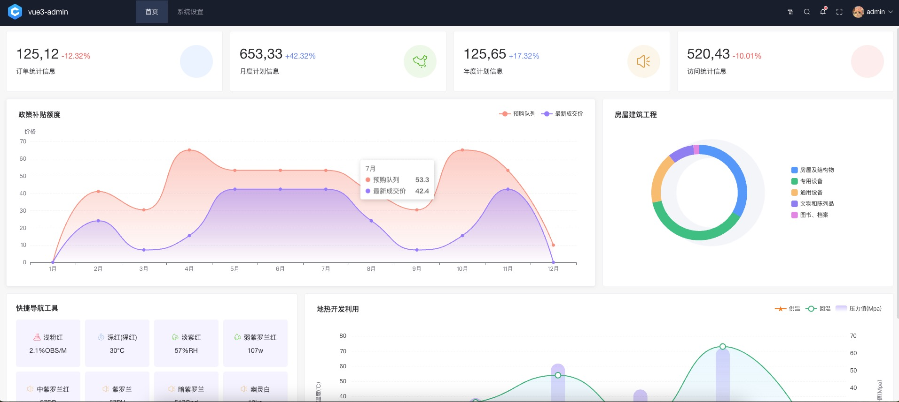
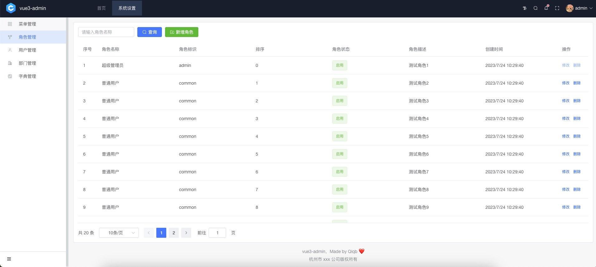

#### 🌈 介绍 

基于 vue-next-admin-template 模板进行精简，只保留了自己需要的经典菜单分栏样式，其余不相关的代码全部删除，仿照腾讯蓝鲸开源项目的UI样式，进行了UI界面美化

#### 🚧 安装 cnpm、yarn

- 复制代码(桌面 cmd 运行) `npm install -g cnpm --registry=https://registry.npm.taobao.org`
- 复制代码(桌面 cmd 运行) `npm install -g yarn`

#### 🏭 环境支持

| Edge      | Firefox      | Chrome      | Safari      |
| --------- | ------------ | ----------- | ----------- |
| Edge ≥ 88 | Firefox ≥ 78 | Chrome ≥ 87 | Safari ≥ 13 |

> 由于 Vue3 不再支持 IE11，故而 ElementPlus 也不支持 IE11 及之前版本。

#### ⚡ 使用说明

建议使用 cnpm，因为 yarn 有时会报错。<a href="http://nodejs.cn/" target="_blank">node 版本 > 14.18+/16+</a>

> Vite 不再支持 Node 12 / 13 / 15，因为上述版本已经进入了 EOL 阶段。现在你必须使用 Node 14.18+ / 16+ 版本。

```bash
# 克隆项目
git clone https://gitee.com/qiqb_admin/vue3-admin-template

# 进入项目
cd vue3-admin-template

# 安装依赖
cnpm install

# 运行项目
cnpm run dev

# 打包发布
cnpm run build
```

## 项目预览图

<table>
  <tr>
    <td></td>
  </tr>
  <tr>
    <td></td>
  </tr>
</table>


#### ❤️ 特别鸣谢

- <a href="https://gitee.com/lyt-top/vue-next-admin" target="_blank">vue-next-admin</a>
